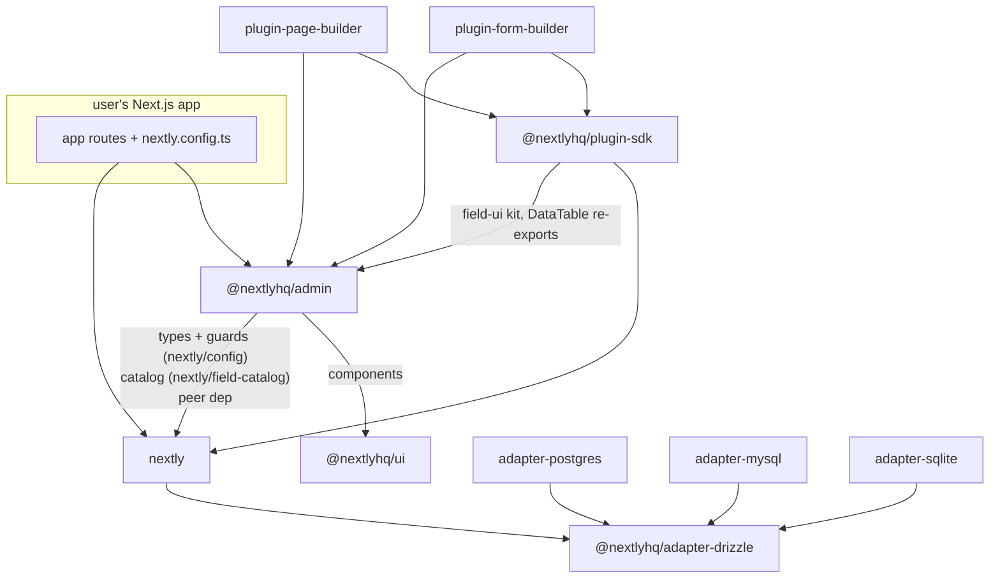

# Nextly Architecture

A bird's-eye map of the codebase: how the layers relate, where the boundaries
are, and which invariants must not be broken. For build/test commands and
conventions, see AGENTS.md and CONTRIBUTING.md. For user-facing docs, see
`docs/` (published at nextlyhq.com/docs).

## Overview

Nextly is a CMS and app framework that runs INSIDE the user's Next.js app.
There is no hosted service: the user's project mounts routes that delegate to
our packages, and everything (admin panel, REST API, schema management,
media) executes in their app against their database.

```text
user's Next.js app
├── src/app/admin/[[...params]]/page.tsx        -> renders <RootLayout/> from @nextlyhq/admin
├── src/app/admin/api/[[...params]]/route.ts    -> createDynamicHandlers() from nextly/runtime
├── src/app/api/health/route.ts                 -> standalone route modules from nextly/api/*
├── src/app/api/media/[[...path]]/route.ts      -> (health, media, ...)
└── nextly.config.ts                            -> defineConfig({ collections, singles, plugins, db, ... })
```

The dynamic catch-all handler is mounted under `/admin/api`; a handful of
public surfaces (health, media delivery) are separate route modules mounted
under `/api/*`.

Content schema can be authored two ways over the same data model: code-first
(`defineCollection` in `nextly.config.ts`) or visually (the Schema Builder in
the admin panel). This dual approach is the framework's defining feature and
shapes most of the architecture below.

## Repository structure

```text
packages/
├── nextly              core: config, Direct API, REST dispatcher, CLI, auth,
│                       schema pipeline, migrations, media, email
├── admin               admin panel UI (React, mounted via catch-all route)
├── ui                  shared React components + the design-token theme
├── adapter-drizzle     shared Drizzle adapter logic
├── adapter-postgres    │
├── adapter-mysql       ├ per-dialect adapters extending adapter-drizzle
├── adapter-sqlite      │
├── plugin-sdk          the ONLY stable import surface for plugin authors
├── plugin-form-builder │
├── plugin-page-builder ├ first-party plugins
├── storage-s3          │
├── storage-vercel-blob ├ media storage adapters
├── storage-uploadthing │
├── create-nextly-app   scaffolding CLI (consumes /templates)
├── telemetry           anonymous CLI telemetry (private)
└── eslint-config, prettier-config, tsconfig   shared tooling (private)
apps/playground         contributor dev harness
templates/              base, blank, blog, plugin (scaffolded into user apps)
e2e/                    Playwright suite (boots its own playground on :3100)
docs/                   user documentation (MDX)
```

## Package layering and dependency graph



The load-bearing rules:

- **The `nextly` root export is Node-safe.** Next.js-coupled code lives behind
  the `nextly/runtime` subpath. `nextly/config` exposes only types, field
  factories, and guards, which is why admin can import from it without
  dragging runtime code into the browser bundle.
- **The plugin surface is two packages, both versioned contracts.**
  `@nextlyhq/plugin-sdk` covers admin integration: it re-exports from core
  (plugin definition, events) and admin (the field-UI kit, DataTable) so
  plugins never take direct dependencies on internals. `@nextlyhq/ui` covers
  presentation: the React primitives the admin itself is built from, plus the
  design tokens. Each has a `@public`/`@experimental` ledger
  (`packages/plugin-sdk/STABILITY.md`, `packages/ui/STABILITY.md`) and a
  snapshot guard over its exported names. `@nextlyhq/admin` is an application,
  not an API, and remains off-limits.
- **Adapters contain no field-type knowledge.** They execute Drizzle schema
  and queries; the mapping from field types to columns lives in core (see the
  field-type system below).
- **`@nextlyhq/ui` has no workspace dependencies** and owns the design tokens.
  It is a peer dependency of admin, not a bundled one: it ships React context,
  so a second copy in an install tree gives portals a second context and they
  render into the wrong container.

## The field-type system

One canonical `FieldType` union (18 members) drives everything, with three
cooperating layers in `packages/nextly`:

1. **Config layer** (`src/collections/fields/`): per-type config interfaces
   (`types/`), factory helpers (`helpers.ts`: `text()`, `richText()`,
   `repeater()`, ...), and type guards (`guards.ts`). The structured-array
   type is `repeater`; `array()` survives only as a compat alias.
2. **Serializable catalog** (`src/collections/fields/catalog.ts`, published
   as `nextly/field-catalog`): pure data describing each type (label,
   category, hint, Lucide icon NAME). Every picker UI (schema builder,
   user-fields page, form builder, the plugin-facing field-UI kit) renders
   from this catalog and narrows it with `narrowFieldTypeCatalog`; no surface
   redeclares a type list. Surface-only types (`url`/`phone` for users, plus
   `file`/`time`/`hidden` for forms) are deliberately NOT in the canonical
   union so they can never reach the column mappers; they store as text (or
   in the form's JSON blob) with validation semantics.
3. **Column mapping, single source of truth**
   (`src/domains/schema/services/field-column-descriptor.ts`): per-dialect
   descriptors consumed by the runtime schema generator, the migration diff
   builder, and the DDL emitters. Adding a built-in field type means touching
   the union, a config interface, the factory, the guard, the catalog entry,
   the column descriptor, validation (zod generator), the TS type generator,
   and the admin renderers; there is a contributor skill for the full recipe.

Plugins contribute field types declaratively (`contributes.fieldTypes`: type
id, storage primitive, admin component, allowed surfaces) through a
boot-time registry that throws on collisions with built-ins. Withdrawn plugin
types degrade to read-only rather than dropping data.

## The schema pipeline

Two authoring paths converge on one pipeline:

- **Code-first:** `nextly.config.ts` -> `nextly db:sync` (or, in dev, the HMR
  listener in `src/runtime/hmr-listener.ts` applies changes in-process on the
  next request; there is deliberately no `nextly dev` command).
- **Visual (Schema Builder):** admin UI -> the collections-schema API routes
  (gated by `requireBuilderEnabled`) -> `domains/schema/ui-schema/mutate.ts`
  -> `ui-schema.json` in the user's project (path from `db.uiSchemaFile`).
  `db:sync --promote/--demote` moves a collection between the two approaches.

Both paths record schema history in the `nextly_schema_events` journal table,
which powers drift detection (`migrate:check`), `migrate:status`, and the
first-run/boot checks (`src/init/`). Production flow: `nextly migrate:create`
diffs config against the journal and emits SQL with a `-- DOWN` section;
`nextly migrate` applies with a lock; `migrate:down` rolls back a single
step. Test fixtures must create system tables through the same DDL helpers
the pipeline uses (for example `getSchemaEventsDdl`), never hand-copied SQL.

## Request flow

```text
HTTP request to /admin/api/[[...params]] (the dynamic catch-all)
  -> createDynamicHandlers (src/routeHandler.ts)
    -> parseRestRoute (src/route-handler/route-parser.ts)   resource + operation
    -> auth middleware                                      session or API key
    -> ServiceDispatcher (src/dispatcher/dispatcher.ts)
         services: users, auth, collections, singles, forms, components,
                   rbac, userFields, emailProviders, emailTemplates
    -> domain handlers (src/dispatcher/handlers/*, src/domains/*)
    -> response envelopes (src/api/response-shapes.ts)
```

Some resources (media, uploads, health, api-keys, dashboard, schema journal,
general-settings, image-sizes) are served by standalone modules under
`src/api/*` rather than the dispatcher switch. Plugin routes are served by
the same catch-all under `plugins/<name>` (so `/admin/api/plugins/<name>`
with the standard mount).

Every response uses a canonical envelope: `{ items, meta }` for lists,
`{ message, item }` for mutations, plus `respondDoc`/`respondAction`/
`respondCount`/`respondBulk` variants. Errors always serialize as
`{ error: { code, message, requestId, messageKey?, data? } }` via
`NextlyError.toResponseJSON` and the `withErrorHandler` wrapper; error codes
map to canonical HTTP statuses in `src/errors/error-codes.ts`.

## Direct API vs REST

The same operations exist twice, on purpose:

- **Direct API** (`nextly.find/create/update/delete` from `nextly`,
  `src/direct-api/`): in-process, no HTTP, fully typed after
  `nextly generate:types`. Defaults to `overrideAccess: true` (trusted server
  context); passing `overrideAccess: false` plus `user` enforces the same
  access control, hooks, and validation as REST. This is the recommended path
  for the user's own server code.
- **REST API**: the dispatcher flow above, for untrusted or external callers.

Both return the same shapes (`{ items, meta }`, `.item`), so knowledge
transfers 1:1 between them.

## Auth model

Two mechanisms, distinguished by `AuthContext.authMethod`:

- **Cookie sessions**: short-lived JWT access token + refresh token
  (HTTP-only cookies, `jose`-based), for the admin panel and browser callers.
  Some endpoints are session-only.
- **API keys**: `Authorization: Bearer nx_live_...`, minted in the admin,
  resolved by `ApiKeyService` to a user with roles and permissions, with
  per-key rate limits. This is the machine-to-machine surface.

Authorization is RBAC (roles -> permissions, with field-level access rules);
handlers check permissions via `requirePermission`/`requireCollectionAccess`,
and HTTP methods map to actions (GET=read, POST=create, PATCH/PUT=update,
DELETE=delete). The playground's dev auto-login is hard-blocked in
production by the session handler.

## Plugin system

Plugins are declared with `definePlugin` and registered in `nextly.config.ts`:

- **Declarative `contributes`** (collections, singles, components, field
  types, routes, admin menu/pages/settings, permissions, `extend` for adding
  fields to existing entities): readable WITHOUT executing the plugin, which
  enables introspection, codegen, and safe schema handling.
- **Lifecycle**: `setup(config)` (pure config transform, runs before all
  inits) -> `init(ctx)` -> `destroy(ctx)`. Dependencies (`dependsOn`) are
  topo-sorted; each plugin declares a `nextly` compat range that is checked
  at boot.
- **Context**: `ctx.services` (managed data access), `ctx.events` (on/emit),
  `ctx.logger`, `ctx.config`, `ctx.self` (own slugs after any `rename()`),
  plus experimental hooks/filters/db escape hatches.
- Plugin routes are namespaced under `plugins/<name>` on the dynamic
  catch-all; plugin admin UI
  is referenced by component path and rendered through the admin's component
  registry.

## Admin architecture

- The admin is a client-rendered app mounted by the user's catch-all route.
  It talks to the REST API exclusively and parses errors with
  `parseApiError` against the canonical envelope (it never imports
  `NextlyError`).
- **Styling is fully scoped**: source styles use `:root`/`.dark` selectors,
  and a build-time scoper rewrites them under the `.nextly-admin` wrapper so
  admin CSS cannot leak into the user's site. All colors and surfaces come
  from `--nx-*` design tokens defined for light AND dark in
  `packages/ui/src/styles/theme.css`; runtime branding overrides inject
  `--nx-primary`/`--nx-accent` from `defineConfig().admin.branding`.
- Entry rendering flows through `FieldRenderer` (per-type components);
  pickers render from the field-type catalog. The field-UI kit
  (`src/components/field-ui/`) is the shared, plugin-facing set of field
  editors, re-exported through the plugin SDK.
- Heavy dependencies listed in the tsup externals (React Query, Lexical,
  CodeMirror, ...) are excluded from the bundle and resolve from the
  consumer's node_modules.

## Media and storage

Media entries live in core with a storage-adapter interface; the storage
packages (S3/R2/MinIO, Vercel Blob, UploadThing) implement upload, URL
resolution, and deletion. Uploads pass a security pipeline (filename and
extension checks, MIME and magic-byte verification, size limits, SVG
sanitization) whose failure modes are first-class error codes.

## Key invariants (do not break these)

1. The `nextly` root export stays Node-safe; Next-coupled code stays behind
   `nextly/runtime`.
2. All published packages version in lockstep (one changeset per PR covering
   all of them; `patch` during alpha).
3. Database access is Drizzle-only; field-to-column mapping exists ONLY in
   `field-column-descriptor.ts`.
4. Every API response uses the canonical envelopes; errors always carry a
   code from `error-codes.ts` and a request id.
5. Plugins import only from `@nextlyhq/plugin-sdk` (admin integration) and
   `@nextlyhq/ui` (presentational primitives), never from `@nextlyhq/admin`.
   Both carry `@public`/`@experimental` markers, and those markers are
   contracts.
6. Field-type lists render from the serializable catalog; no UI surface
   hand-maintains its own list.
7. Admin styles stay inside `.nextly-admin` and use `--nx-*` tokens with
   both light and dark values.
8. Surface-only field types never enter the canonical `FieldType` union.
