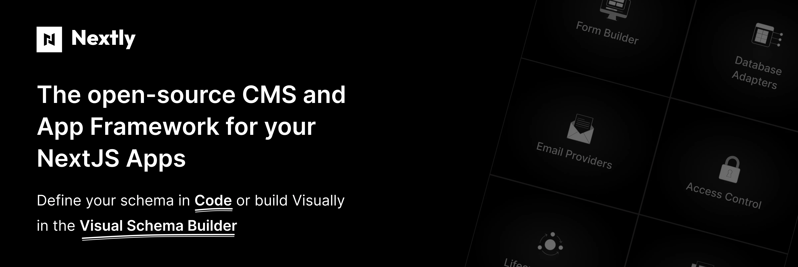

<!-- Add a social preview image at GitHub repo Settings → Social preview to control the link card shown when this repo is shared. -->

<p align="center">
  <a href="https://nextlyhq.com">
    <picture>
      <source media="(prefers-color-scheme: dark)" srcset="./.github/assets/nextly-github-banner-dark.webp">
      
    </picture>
  </a>
</p>

<p align="left">
  <a href="https://nextlyhq.com/docs"><strong>Docs</strong></a> ·
  <a href="https://github.com/nextlyhq/nextly/discussions"><strong>Discussions</strong></a> ·
  <a href="https://github.com/nextlyhq/nextly/issues"><strong>Issues</strong></a> ·
  <a href="https://discord.gg/hJUg9AZMn"><strong>Discord</strong></a> ·
  <a href="https://nextlyhq.com"><strong>Website</strong></a>
</p>

<p align="left">
  <a href="https://www.npmjs.com/package/nextly"></a>
  <a href="https://github.com/nextlyhq/nextly/actions/workflows/ci.yml"></a>
  <a href="https://github.com/nextlyhq/nextly/blob/main/LICENSE.md"></a>
  <a href="https://github.com/nextlyhq/nextly/stargazers"></a>
  <a href="https://github.com/nextlyhq/nextly/commits/main"></a>
</p>

<p align="left">
  <a href="https://vercel.com/open-source-program">
    
  </a>
</p>

<br/>

> [!IMPORTANT]
> Nextly is in alpha. APIs may change before 1.0. Pin exact versions in production.

Nextly is a TypeScript-first, Next.js-native CMS and app framework. Define your content schema in code or build it visually in the admin UI, choose your database, and get a fully-typed REST and Direct API plus a customizable admin dashboard. No SaaS, no proprietary cloud. Your data, your stack.

<!--
HERO VISUAL PLACEHOLDER
======================
Swap the box below for a real screenshot, GIF, or short video of the admin
panel before publishing. Recommended: 1600x900 PNG or MP4 < 5 MB.
-->

<!-- <p align="center">
  
</p> -->

## Why Nextly?

- **Code-first or visual schema.** Define collections in TypeScript, or build them in the Schema Builder. Same data model either way.
- **Type-safe everywhere.** REST API, Direct API, and the admin UI are typed end-to-end.
- **Pluggable databases.** PostgreSQL, MySQL, SQLite via official adapters.
- **Pluggable storage.** Local disk by default; S3 (and R2, MinIO), Vercel Blob, or UploadThing for production.
- **Granular access control.** Roles, permissions, and field-level access out of the box.
- **Self-hosted, MIT-licensed.** Your stack, your data, no vendor lock-in.

## Quickstart

```bash
# pnpm
pnpm create nextly-app@alpha my-app

# npm
npx create-nextly-app@alpha my-app

# yarn
yarn create nextly-app@alpha my-app

# bun
bun create nextly-app@alpha my-app
```

That's it. Follow the prompts and you'll have a running CMS with admin panel and database in under a minute.

> Prefer a manual setup? See the [installation guide](https://nextlyhq.com/docs/getting-started/installation) for clone-and-configure instructions, Docker, and database options.

## A tiny example

A minimal `nextly.config.ts` that defines a `posts` collection and exposes a typed API:

```ts
import {
  defineConfig,
  defineCollection,
  text,
  richText,
  relationship,
} from "nextly";

const Posts = defineCollection({
  slug: "posts",
  fields: [
    text({ name: "title", required: true }),
    richText({ name: "body" }),
    relationship({ name: "author", relationTo: "users" }),
  ],
});

export default defineConfig({
  collections: [Posts],
});
```

Set `DATABASE_URL` (and `DB_DIALECT`) in your `.env`; Nextly picks the dialect automatically. `Posts.title` and `Posts.body` are typed end to end, queryable via REST or Direct API, and editable from the admin panel.

## Packages

### Core

| Package               | Description                                                     |
| --------------------- | --------------------------------------------------------------- |
| **nextly**            | Core CMS: database, services, REST and Direct APIs, RBAC, hooks |
| **@nextlyhq/admin**   | Admin dashboard and management interface                        |
| **@nextlyhq/ui**      | Headless UI components shared across packages and plugins       |
| **create-nextly-app** | CLI scaffold for new Nextly projects                            |

### Database adapters

| Package                        | Description                                     |
| ------------------------------ | ----------------------------------------------- |
| **@nextlyhq/adapter-postgres** | PostgreSQL adapter (recommended for production) |
| **@nextlyhq/adapter-mysql**    | MySQL adapter                                   |
| **@nextlyhq/adapter-sqlite**   | SQLite adapter (local demos only)               |

### Storage adapters

| Package                           | Description                            |
| --------------------------------- | -------------------------------------- |
| **@nextlyhq/storage-s3**          | Amazon S3 (also R2, MinIO, B2, Wasabi) |
| **@nextlyhq/storage-vercel-blob** | Vercel Blob storage                    |
| **@nextlyhq/storage-uploadthing** | UploadThing storage                    |

### Plugins (coming soon, beta)

| Package                           | Description                                      |
| --------------------------------- | ------------------------------------------------ |
| **@nextlyhq/plugin-form-builder** | Drag-and-drop form builder _(coming soon, beta)_ |

> Public plugin support (stable APIs, plugin gallery, documentation guarantees) lands at the Nextly **beta** release. The package above is published for early exploration only. Surfaces and behaviour will change.

## Requirements

| Tool       | Minimum                                           |
| ---------- | ------------------------------------------------- |
| Node.js    | 20+ (Node 22 LTS recommended)                     |
| pnpm       | 9+ recommended; npm, yarn, and bun also supported |
| Next.js    | 16+ (App Router required)                         |
| React      | 19+                                               |
| TypeScript | 5+                                                |

### Database support

| Database                                                  | Minimum | Notes                                                                                                    |
| --------------------------------------------------------- | ------- | -------------------------------------------------------------------------------------------------------- |
| [PostgreSQL](https://nextlyhq.com/docs/database/postgres) | 15.0+   | Standard PG, Neon (also reachable via Vercel Marketplace), Supabase, RDS, Aurora PG, Railway, Cloud SQL. |
| [MySQL](https://nextlyhq.com/docs/database/mysql)         | 8.0+    | MariaDB, TiDB, Aurora MySQL, PlanetScale, Vitess on best-effort.                                         |
| [SQLite](https://nextlyhq.com/docs/database/sqlite)       | 3.38+   | Bundled with `better-sqlite3`. Local demos only.                                                         |

See the [database support docs](https://nextlyhq.com/docs/database/support) for the full version policy and cloud-provider notes.

## Documentation

- [**Installation**](https://nextlyhq.com/docs/getting-started/installation): get started in minutes
- [**Quick start**](https://nextlyhq.com/docs/getting-started/quick-start): build a blog in 5 minutes
- [**Configuration**](https://nextlyhq.com/docs/configuration): collections, singles, fields, hooks
- [**Visual Schema Builder**](https://nextlyhq.com/docs/admin/builder): define schema in the admin UI
- [**Authentication & permissions**](https://nextlyhq.com/docs/guides/authentication): RBAC, API keys, JWT
- [**REST API**](https://nextlyhq.com/docs/api-reference/rest-api) and [**Direct API**](https://nextlyhq.com/docs/api-reference/direct-api)
- [**Database**](https://nextlyhq.com/docs/database): Postgres, MySQL, SQLite adapters
- [**Admin customization**](https://nextlyhq.com/docs/admin/customization): extend the dashboard
- [**Plugin development**](https://nextlyhq.com/docs/plugins): build your own integrations
- [**Deployment**](https://nextlyhq.com/docs/guides/deployment): Vercel, Docker, and more

## Examples

- [**Blog template**](./templates/blog): production-quality blog with seeded content, RSS, sitemap, search
- [**Blank template**](./templates/blank): minimal starter for building from scratch

## How Nextly compares

Nextly draws inspiration from each of these projects. The table compares Nextly against the most common Next.js CMS choices, both self-hosted and SaaS. If you want a fully managed SaaS that you do not run yourself, Sanity is the strongest pick on the right; if you want to own your stack and your data, look at the left.

| Dimension                         | Nextly                  | Payload                   | Strapi v5                                      | Sanity                                              |
| --------------------------------- | ----------------------- | ------------------------- | ---------------------------------------------- | --------------------------------------------------- |
| License                           | MIT                     | MIT                       | MIT (+ EE)                                     | MIT (Studio); proprietary SaaS (Content Lake)       |
| Self-hostable                     | yes                     | yes                       | yes                                            | no (SaaS only)                                      |
| All features free (no paid gates) | yes                     | yes                       | no (advanced RBAC, SSO, audit log gated in EE) | no (free tier + usage-based paid plans)             |
| Hosted in your Next.js app        | yes                     | yes                       | no (separate Node server)                      | no (Studio mounts in your app; data is hosted SaaS) |
| Code-first schema                 | yes                     | yes                       | partial (CLI generators)                       | yes                                                 |
| Visual schema builder             | yes                     | no                        | yes                                            | no                                                  |
| Both code-first **and** visual    | yes                     | no                        | partial                                        | no                                                  |
| Database / storage                | Postgres, MySQL, SQLite | Postgres, MongoDB, SQLite | Postgres, MySQL/MariaDB, SQLite                | Sanity Content Lake (managed)                       |

## Roadmap

See [`nextlyhq.com/roadmap`](https://nextlyhq.com/roadmap) for what's next.

## Community

- [**GitHub Discussions**](https://github.com/nextlyhq/nextly/discussions) for questions, ideas, and show-and-tell
- [**Issues**](https://github.com/nextlyhq/nextly/issues) for bug reports and feature requests
- [**Discord**](https://discord.gg/hJUg9AZMn) for real-time chat with the team and other users
- [**Contributing guide**](./CONTRIBUTING.md) for local setup, the dev workflow, and PR conventions
- [**Code of Conduct**](./CODE_OF_CONDUCT.md) for how we behave as a community

## Contributing

Contributions of every size are welcome: typo fixes, new database adapters, plugins, docs improvements, anything. Start with the [Contributing guide](./CONTRIBUTING.md) for local setup, the development workflow, and our PR/commit conventions.

Local boot is one command: `pnpm install && pnpm dev:app` from a fresh clone lands a working `/admin` with seeded demo content in roughly a minute. SQLite by default, no Docker required. `pnpm dev:postgres` and `pnpm dev:mysql` are opt-in if you want to test against those.

## Telemetry

The Nextly CLI (`create-nextly-app` and `nextly`) collects anonymous usage data to help us improve the tool. No personal information, project contents, file paths, or secrets are collected. Telemetry is automatically disabled in CI, Docker, production, and non-interactive shells.

See [nextlyhq.com/docs/telemetry](https://nextlyhq.com/docs/telemetry) for the full list of what is and is not collected, and for instructions on opting out (`nextly telemetry disable` or `NEXTLY_TELEMETRY_DISABLED=1`).

## License

[MIT](./LICENSE.md). Free to use, modify, and distribute.
